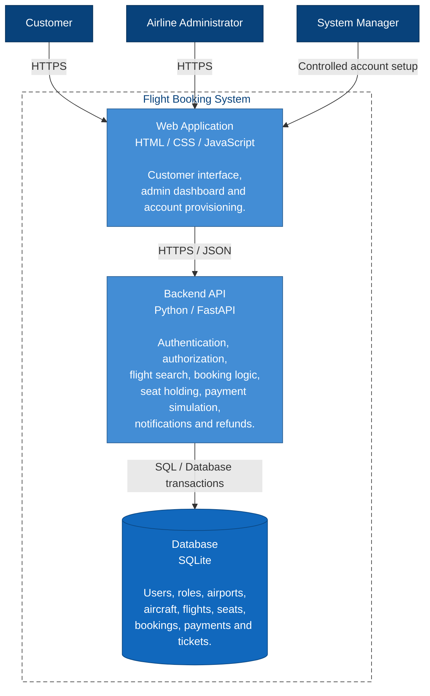

# C4 Level 2 - Container Diagram
## Flight Booking System (Group 17)

This diagram shows the main containers inside the
Flight Booking System and how they communicate.

```mermaid
flowchart TB

    customer["Customer"]
    admin["Airline Administrator"]
    manager["System Manager"]

    subgraph boundary["Flight Booking System"]

        web["Web Application<br/>HTML / CSS / JavaScript<br/><br/>Customer interface,<br/>admin dashboard and account provisioning."]

        api["Backend API<br/>Python / FastAPI<br/><br/>Authentication, authorization,<br/>flight search, booking logic,<br/>seat holding, payment simulation,<br/>notifications and refunds."]

        db[("Database<br/>SQLite<br/><br/>Users, roles, airports,<br/>aircraft, flights, seats,<br/>bookings, payments and tickets.")]

    end

    customer -->|"HTTPS"| web
    admin -->|"HTTPS"| web
    manager -->|"Controlled account setup"| web

    web -->|"HTTPS / JSON"| api

    api -->|"SQL / Database transactions"| db

    classDef person fill:#08427b,stroke:#052e56,color:#fff
    classDef container fill:#438dd5,stroke:#2e6295,color:#fff
    classDef database fill:#1168bd,stroke:#0b4884,color:#fff

    class customer,admin,manager person
    class web,api container
    class db database

    style boundary fill:#ffffff,stroke:#444444,stroke-dasharray:6 4,color:#08427b
```
