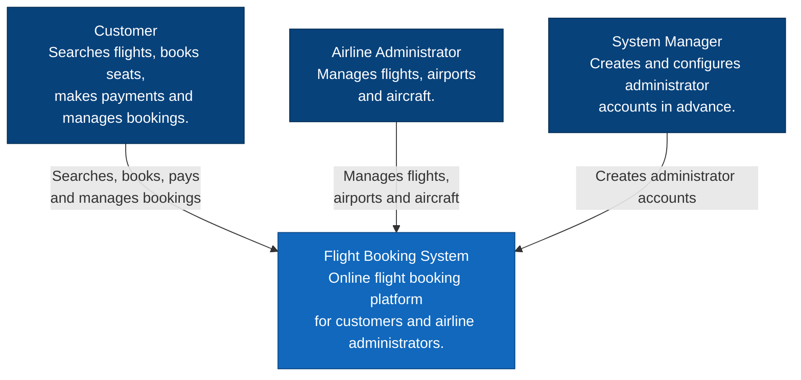

# C4 Level 1 - System Context
## Flight Booking System (Group 17)

This diagram shows the Flight Booking System as a black box,
its users, and their interactions with the system.

```mermaid
flowchart TB
    customer["Customer<br/>Searches flights, books seats,<br/>makes payments and manages bookings."]

    admin["Airline Administrator<br/>Manages flights, airports<br/>and aircraft."]

    manager["System Manager<br/>Creates and configures administrator<br/>accounts in advance."]

    fbs["Flight Booking System<br/>Online flight booking platform<br/>for customers and airline administrators."]

    customer -->|"Searches, books, pays<br/>and manages bookings"| fbs

    admin -->|"Manages flights,<br/>airports and aircraft"| fbs

    manager -->|"Creates administrator accounts"| fbs

    classDef person fill:#08427b,stroke:#052e56,color:#fff
    classDef system fill:#1168bd,stroke:#0b4884,color:#fff

    class customer,admin,manager person
    class fbs system
```
