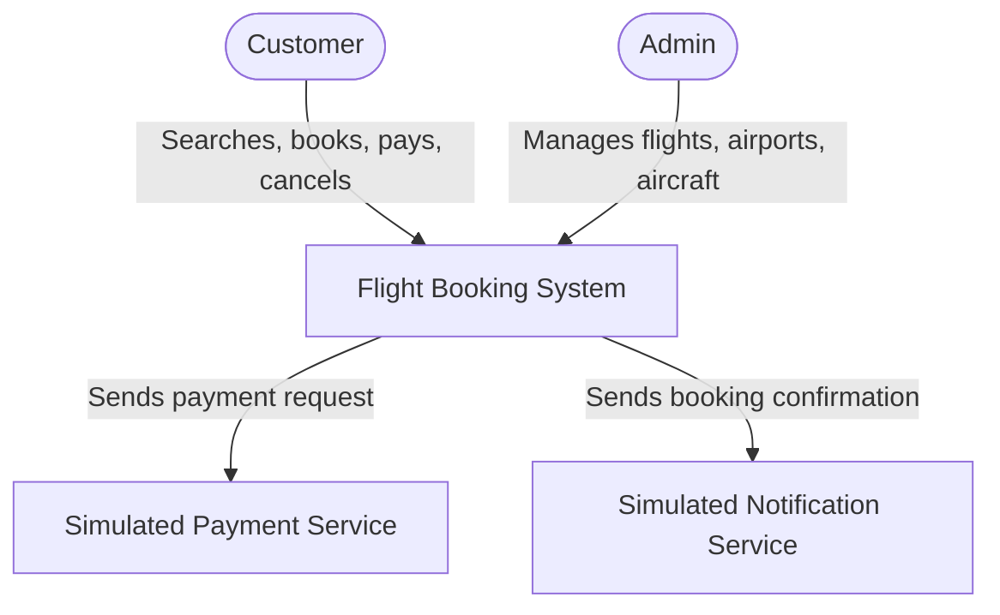
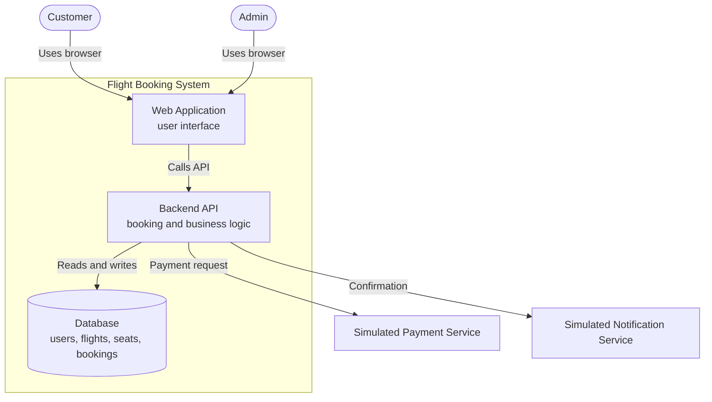

# C4 Diagrams - Flight Booking System

## Level 1: System Context

```mermaid
flowchart TB
    C([Customer])
    A([Admin])
    S[Flight Booking System]
    P[Simulated Payment Service]
    N[Simulated Notification Service]

    C -->|Searches, books, pays, cancels| S
    A -->|Manages flights, airports, aircraft| S
    S -->|Sends payment request| P
    S -->|Sends booking confirmation| N
```

## Level 2: Containers

```mermaid
flowchart TB
    C([Customer])
    A([Admin])

    subgraph SYS[Flight Booking System]
        W[Web Application<br/>user interface]
        B[Backend API<br/>booking and business logic]
        D[(Database<br/>users, flights, seats, bookings)]
    end

    P[Simulated Payment Service]
    N[Simulated Notification Service]

    C -->|Uses browser| W
    A -->|Uses browser| W
    W -->|Calls API| B
    B -->|Reads and writes| D
    B -->|Payment request| P
    B -->|Confirmation| N
```
