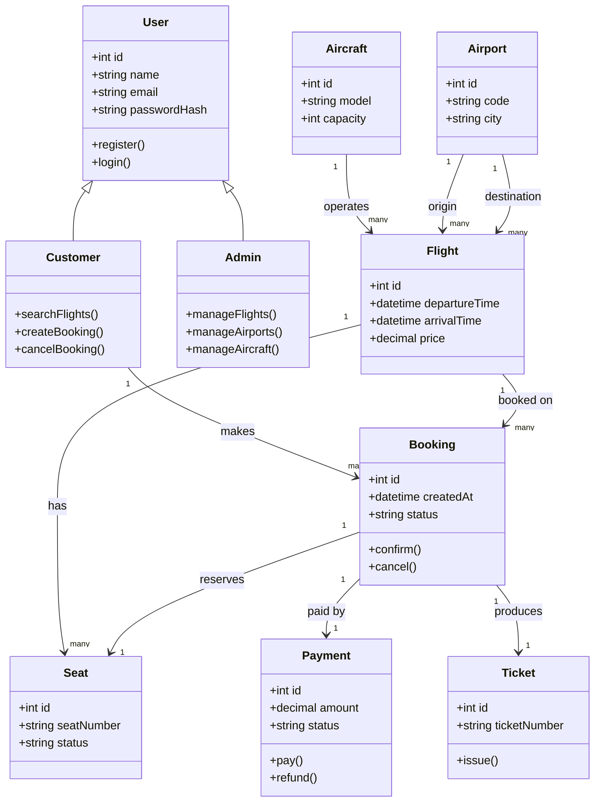

# Class Diagram - Flight Booking System

```mermaid
classDiagram
    class User {
        +int id
        +string name
        +string email
        +string passwordHash
        +register()
        +login()
    }
    class Customer {
        +searchFlights()
        +createBooking()
        +cancelBooking()
    }
    class Admin {
        +manageFlights()
        +manageAirports()
        +manageAircraft()
    }
    class Airport {
        +int id
        +string code
        +string city
    }
    class Aircraft {
        +int id
        +string model
        +int capacity
    }
    class Flight {
        +int id
        +datetime departureTime
        +datetime arrivalTime
        +decimal price
    }
    class Seat {
        +int id
        +string seatNumber
        +string status
    }
    class Booking {
        +int id
        +datetime createdAt
        +string status
        +confirm()
        +cancel()
    }
    class Payment {
        +int id
        +decimal amount
        +string status
        +pay()
        +refund()
    }
    class Ticket {
        +int id
        +string ticketNumber
        +issue()
    }

    User <|-- Customer
    User <|-- Admin
    Aircraft "1" --> "many" Flight : operates
    Airport "1" --> "many" Flight : origin
    Airport "1" --> "many" Flight : destination
    Flight "1" --> "many" Seat : has
    Customer "1" --> "many" Booking : makes
    Flight "1" --> "many" Booking : booked on
    Booking "1" --> "1" Seat : reserves
    Booking "1" --> "1" Payment : paid by
    Booking "1" --> "1" Ticket : produces
```
