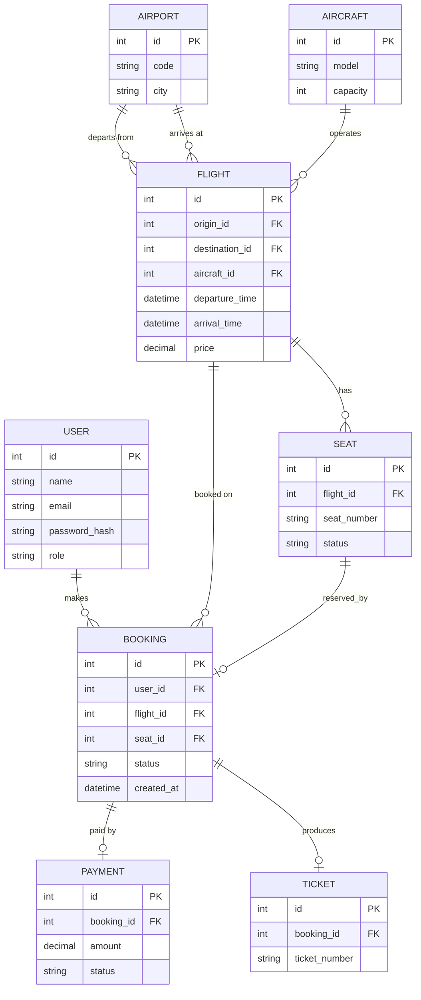

# ERD - Data Model

```mermaid
erDiagram
    USER ||--o{ BOOKING : makes
    AIRPORT ||--o{ FLIGHT : "departs from"
    AIRPORT ||--o{ FLIGHT : "arrives at"
    AIRCRAFT ||--o{ FLIGHT : operates
    FLIGHT ||--o{ SEAT : has
    FLIGHT ||--o{ BOOKING : "booked on"
    SEAT ||--o| BOOKING : reserved_by
    BOOKING ||--o| PAYMENT : "paid by"
    BOOKING ||--o| TICKET : produces

    USER {
        int id PK
        string name
        string email
        string password_hash
        string role
    }
    AIRPORT {
        int id PK
        string code
        string city
    }
    AIRCRAFT {
        int id PK
        string model
        int capacity
    }
    FLIGHT {
        int id PK
        int origin_id FK
        int destination_id FK
        int aircraft_id FK
        datetime departure_time
        datetime arrival_time
        decimal price
    }
    SEAT {
        int id PK
        int flight_id FK
        string seat_number
        string status
    }
    BOOKING {
        int id PK
        int user_id FK
        int flight_id FK
        int seat_id FK
        string status
        datetime created_at
    }
    PAYMENT {
        int id PK
        int booking_id FK
        decimal amount
        string status
    }
    TICKET {
        int id PK
        int booking_id FK
        string ticket_number
    }
```
