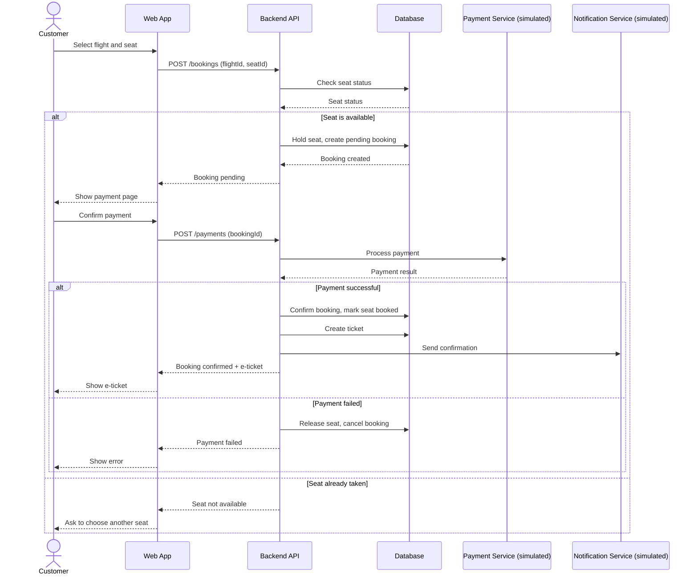

# Sequence Diagram - Book a Flight (UC-01)

```mermaid
sequenceDiagram
    actor C as Customer
    participant W as Web App
    participant B as Backend API
    participant D as Database
    participant P as Payment Service (simulated)
    participant N as Notification Service (simulated)

    C->>W: Select flight and seat
    W->>B: POST /bookings (flightId, seatId)
    B->>D: Check seat status
    D-->>B: Seat status

    alt Seat is available
        B->>D: Hold seat, create pending booking
        D-->>B: Booking created
        B-->>W: Booking pending
        W-->>C: Show payment page

        C->>W: Confirm payment
        W->>B: POST /payments (bookingId)
        B->>P: Process payment
        P-->>B: Payment result

        alt Payment successful
            B->>D: Confirm booking, mark seat booked
            B->>D: Create ticket
            B->>N: Send confirmation
            B-->>W: Booking confirmed + e-ticket
            W-->>C: Show e-ticket
        else Payment failed
            B->>D: Release seat, cancel booking
            B-->>W: Payment failed
            W-->>C: Show error
        end
    else Seat already taken
        B-->>W: Seat not available
        W-->>C: Ask to choose another seat
    end
```
