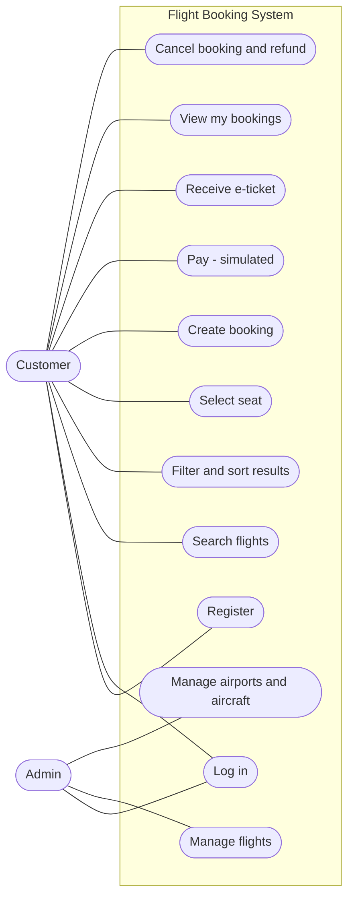

# Use Case Diagram - Flight Booking System

```mermaid
flowchart LR
    C([Customer])
    A([Admin])

    subgraph S[Flight Booking System]
        UC1([Register])
        UC2([Log in])
        UC3([Search flights])
        UC4([Filter and sort results])
        UC5([Select seat])
        UC6([Create booking])
        UC7([Pay - simulated])
        UC8([Receive e-ticket])
        UC9([View my bookings])
        UC10([Cancel booking and refund])
        UC11([Manage flights])
        UC12([Manage airports and aircraft])
    end

    C --- UC1
    C --- UC2
    C --- UC3
    C --- UC4
    C --- UC5
    C --- UC6
    C --- UC7
    C --- UC8
    C --- UC9
    C --- UC10

    A --- UC2
    A --- UC11
    A --- UC12
```
